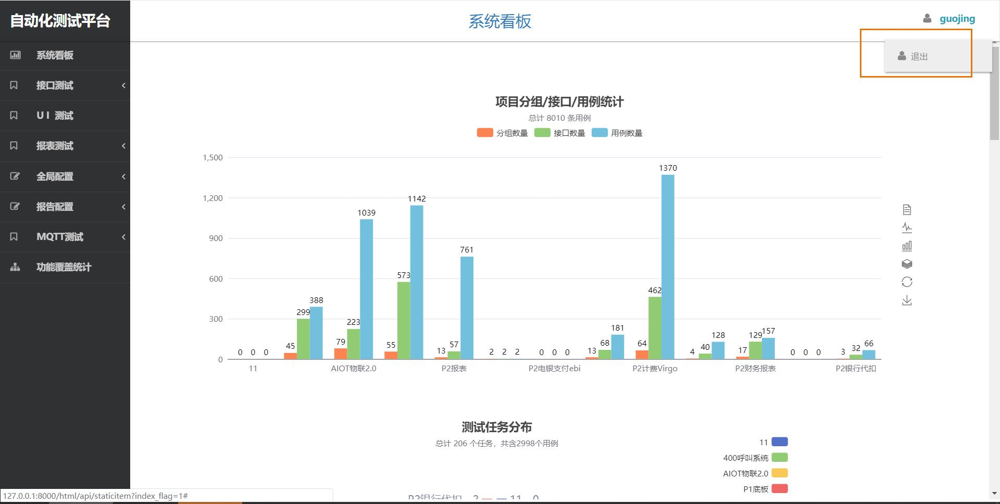
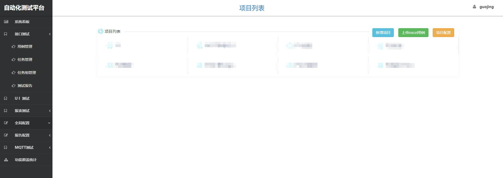

## 前言
2022年4月6日18:57:42：  
**代码已下架，仅开放使用文档为同好小伙伴提供设计思路**


<br><br>

 
**☆ 功能介绍&使用文档详情可查看：**   
github：https://github.com/GuoJinga/CrazyTester_pub  
码云：https://gitee.com/Crazy__G/CrazyTester.git  

**☆ 全栈开发简而精但功能又丰富强大、可视化强、用户易上手、高可用的自动化测试平台。  
集成了接口、UI、MQTT、报表四大方向，并通过定时任务、报警通知、统计看板等功能持续监控产品质量，及时通知反馈任务测试结果。**  

☆ **意义：降本提效**  
1、摒弃传统手动测试阶段、代码框架管理阶段、直接进入可视化平台阶段。使即使不会代码的测试小伙伴也能轻松使用平台，参与自动化测试建设，实现自动化复测&回归；  
2、团队在平台共同协作，将所有自动化测试数据资产落库留存，以便复用&流传；  
3、通过自动化运行降低测试人员的测试时间成本、人力成本，提高测试效率、测试准确率、测试可靠性。  

☆ **技术构架：**  
前端bootstrap、后端python+Django、数据库mysql、消息列队RabbitMQ等  
python包：requests、APScheduler、selenium、appium、阿里云SDK等

☆ **项目功能：**  
登录、项目管理、分组管理、用例管理、测试任务（定时任务）、  
全局环境（全局变量、全局域名、全局请求头、全局cookies）、  
统计看板、测试报告、报告通知（企业微信、邮箱、办公OA）等  

☆ **落地成果：**  
总计管理13个项目，通过自动化运行，减少繁琐复杂的人工操作，在多套环境下减轻接口、 UI、MQTT、报表 复测与回归成本，为测试工作降本提效，持续监控产品质量并持续供质量保障。  
1、**接口测试：**  
目前管理 3126个接口、11032条用例、306个测试任务。  
每日定时任务执行用例5455个，平均执行时长10min。相比手工执行5455min+，提效545倍+。  
2、**UI测试：**  
目前管理505条用例、18953步有效步骤。112个测试任务。  
每个任务平均执行时长10min，每执行一个任务解放人力10min。  
3、**MQTT测试：**  
目前管理 1002条Topic、2612条用例、95个测试任务。  
每日定时任务执行用例1033，平均执行时长15min。相比手工执行3099min+，提效206倍+。  
4、**报表测试：**  
目前管理报表43张。  


<br><br>


# 自动化测试平台 使用文档

**此文档对自动化测试平台所有功能进行梳理说明。**  

#### 1. 功能结构


## 登录、登出
<!-- ---- -->

#### 1. 登录
- 界面如下：


#### 2. 登出
- 点击页面右上方用户名按钮即可退出
- 界面如下：



<br><br>


## 全局配置

#### 1、全局环境
- 全局环境包含：全局域名、全局变量、全局请求头、全局cookie。  
- 在接口测试、UI测试、MQTT测试的单用例&任务测试中都需要选择全局环境。
- 界面如下：


#### 2、全局域名 
- 接口测试专用


#### 3、全局变量  
- 全局变量格式如下：
```json
[
	{
		"key": "参数名",
		"value": "参数值",
		"description": "参数描述",
		"enabled": false	// 是否启用
	},
	{
		"key": "key",
		"value": "value",
		"description": "description",
		"enabled": false
	},
	......
]
```


#### 4、全局请求头
- 接口测试专用
- 全局域名格式如下：
```json
{
	"key1": "value1",
	"key2": "value2",
	"key3": "value3",
	......
}
```


#### 5、全局cookies  
- 接口测试专用
- 全局域名格式如下：
```json
{
	"key1": "value1",
	"key2": "value2",
	"key3": "value3",
	......
}
```


<br><br>


### 参数化
- #### 参数化来源
1. 全局变量：通过全局变量中的参数 参数化用例中的变量
2. 前置操作：通过前置操作获取的参数 参数化用例中的变量
3. 变量方法：通过特定方法 参数化用例中的变量

- #### 参数化格式
1. 普通参数化格式：{{variable}}  
	可被参数化的项：请求地址、请求参数、请求体、请求头、请求cookies、样例数据、方法断言  
```
	使用示例：
	
	当前全局变量中数据：
	[
		{
			"key": "name",
			"value": "张三",
			"description": "姓名",
			"enabled": true
		},
		{
			"key": "phone",
			"value": "13120009968",
			"description": "手机号",
			"enabled": true
		}
	]
	
	当前用例中请求体数据：
	{
		"name": "{{name}}",
		"phone": "{{phone}}"
	}
	
	发送用例后，实际请求体数据：
	{
		"name": "张三",
		"phone": "13120009968"
	}
```

2. 变量方法格式：{@xxx}
```
	变量方法：
	{@date}：当天日期：2021-04-12
	{@date+n}：当天日期+n天
	{@date+n}：当天日期-n天
	{@timestamp}： 毫秒级时间戳：1618209388194
	{@num}： 自增长int数字，从1开始
	
	使用示例：
	
	参数化前：
	{
		"key1": "{@date} {@date+1} {@date-2} {@date}",
		"key2": "{@timestamp} {@timestamp} {@timestamp}",
		"key3": "{@num} {@num} {@num} {@num}"
	}
	
	参数化后：
	{
		"key1": "2021-04-17 2021-04-18 2021-04-15 2021-04-17",
		"key2": "1618630477124 1618630477124 1618630477124",
		"key3": "1 2 3 4"
	}
```
	
<br><br>


## 接口测试


## 前言
**使用前请先了解接口测试使用流程、单用例测试流程&参数详解，以便高效进行接口测试。**

#### 1. 测试流程


#### 2. 单用例测试流程与用例参数详解


#### 3. 用例设计思想
- 1、用例设计维度：  
	① 一个接口 由多条用例 不同数据 验证不同的验证点（即断言）  
	② 一条用例 由多条断言 去支撑测试结论  
	③ 一条用例 由多组数据 （样例数据）扩充用例的测试范围、支撑用例可靠性的强度  

- 2、举例：新开发的登录接口  
	① 接口多条用例：账号不可为空、密码不可为空、密码错误、禁用账户....    
	② 一条用例多组数据：这10条密码应都错误     
	③ 禁用账户用例设置断言接口状态码成功400、返回code400、用户状态为-1     

- 3、一条用例不代表只发送一次请求，会发送（样例数据+全局变量）次

- 4、样例数据虽然有多组数据，但视为一条用例，其中一组数据失败则用例失败

<br>

### 一. 系统看板
### 五项指标
<!-- ---- -->
#### 1. 用例统计图

#### 2. 测试任务分布图

#### 3. 最近7天测试结果统计图

#### 4. 近七周用户新增用例统计

#### 5. 用户新增统计


<br><br>


### 二. 项目管理
界面如下：


#### 1. 新增项目
> 按钮权限：仅超级管理员可见  

> 新增后 项目只有创建者可见;添加可见用户格式: `zhangsan,lisi,wangwu`

#### 2. 上传excel用例
	1. 用例模板可从分组、接口中下载用例的excel文件作为模板使用。  
	2. excel数据格式  
		① 项目名、分组名、接口名、接口描述、请求方式、用例状态、用例描述、请求地址 为 字符串格式  
		② 入参-url参数、入参-请求体、样例数据、headers、cookies、断言、前置操作、响应设置全局变量 为 json格式
			每个json格式参数具体json内容，下载用例后参照已有数据。  
	3. 上传逻辑：  
		① 没有查到项目名称 则自动创建此新项目  
		② 没有查到分组名称 则在对应项目下创建分组  
		③ 没有查到接口名称 则在对应分组下创建接口  
		④ 没有查到用例名称 则在对应分组下创建用例  
		⑤ 同接口下 已存在相同用例名称 则会更新  
		
#### 3. 项目配置
> 按钮权限：仅超级管理员可见  

> 可配置项目名称、描述、版本号、可见用户

<br><br>

### 三. 分组管理
界面如下：


#### 1. 新增分组
	1. 点击【分组管理】
	2. 输入 分组名称
	3. 点击【新增】

#### 2. 编辑分组
	1. 点击【分组管理】
	2. 选择 要编辑的分组
	3. 输入 新的分组名称
	4. 点击【更新】

#### 3. 删除分组
	1. 点击【分组管理】
	2. 选择 要编辑的分组
	3. 输入 新的分组名称
	4. 点击【删除】

#### 下载用例
> 下载所选分组下所有接口下的所有用例信息。文件格式：excel，下载后可修改excel后使用【上传用例】功能 上传更新


<br><br>

### 四. 接口管理
界面如下：

#### 1. 新增接口
	1. 点击【新增接口】
	2. 选择 所属分组、请求方式、接口名称、接口描述
	3. 点击【新增】
	4. 即可在所选分组下新增接口
	
#### 2. 编辑接口

#### 3. 删除接口

#### 4. 下载接口用例
> 下载接口下所有用例信息。文件格式：excel，下载后可修改excel后使用【上传用例】功能 上传更新


<br><br>

### 五. 用例管理
界面如下：


### 1. 新增用例
> ##### 使用方法一：
	1. 点击【清空】
	2. 填写用例数据
	3. 点击【保存】
	4. 即可将页面上用例数据作为一个新用例 新增到当前接口下

> ##### 使用方法二：在原有用例基础上修改数据 作为一个新用例  
	1. 选择要修改的用例
	2. 在页面修改用例数据
	3. 点击【保存】
	4. 即可将页面上用例数据作为一个新用例 新增到当前接口下

### 2. 更新用例
	1. 选择要修改的用例
	2. 在页面修改用例数据
	3. 点击【更新】
	4. 此用例更新成功

### 3. 删除用例
	1. 选择要修改的用例
	2. 点击【删除】
	3. 删除后会自动进入下一个用例

### 4. 清空用例
	清空用例：所有数据清空（只是在页面展示上清空用例数据），不会做保存操作

### 5. 用例参数说明与填写方式说明

- ### 用例标题、用例描述、用例url地址
	类型：字符串

- ### 请求参数：url参数 & 请求体
	url参数：无论在get还是post请求中，都会把 键值对 直接拼接到地址后面  
	请求体：在get请求中，会拼接到地址后面；在post请求中，会作为单独的请求体；


- ### 样例数据
	样例数据的作用是 期望自己添加的数据都符合断言，会循环请求每一条数据，直到数据都循环完毕，  
	如果某条数据断言失败则停止循环，断言会显示此条数据的失败信息
	为了方便添加样例数据，可以在excel中粘贴数据，在点击【excel与json互转】是粘贴数据转为json格式数据  
	首行为数据名称（用例参数格式化名称），后面的每一行都为实际的数据  


- ### 断言
* 1、字段说明  
	| 项        | 说明   |
	| --------   | -----:  |
	| 状态          | 为1代表启用，非1代表禁用，默认1   |
	| 变量路径     | 要取出的响应内容（python格式的取值写法格式）  |
	| 断言方式      | 提供了一些封装好的方法，也可以选择最后一个方式自己写代码断言   |
	| 期望值        |   可以写str格式、json格式    |
	| 实际值        |   发送请求后可查看实际值   |
	| 断言结果        |   发送请求后可查看断言结果   |  

* 2、断言方式如下：


* 3、部分断言方式实际使用示例：


- ### 实际请求参数
	发送请求后，所有变量 都会被全局变量、前置操作、样例数据 参数化后的实际值  
	测试人员可参考`实际请求参数` 调试优化所写的断言、前置、后置。  
	发送请求后可查看`实际请求参数`  

- ### 响应体
	响应体：返送请求后展示响应的内容  
	发送请求后可查看`响应体`  

- ### 请求头 & 响应头
	请求头：请求接口所用的请求头，正常填写即可
	响应体：返送请求后展示响应的内容
	发送请求后可查看`响应体` 


	
- ### 前置操作
	可以调用其他用例，并取出指定响应数据，放到全局变量中
	| 项        | 说明   |
	| --------   | -----:  |
	| 状态          | 为1代表启用，非1代表禁用，默认1   |
	| 调用用例id     | 已有用例id  |
	| 设置参数名      | 为要取出的内容设置变量名   |
	| 参数键        |   要取出的响应内容（python格式的取值写法格式）   |
	| 实际值        |    发送请求后可查看    |

- ### 后置操作：响应体中的参数设置到全局变量
	1、功能说明：  
	  本次用例执行完毕之后 ，将响应体中的参数提取出来放到全局变量中
	
	2、字段说明
	| 项        | 说明   |
	| --------   | -----:  |
	| 状态          | 为1代表启用，非1代表禁用，默认1   |
	| 变量名称     | 为要取出的内容设置变量名  |
	| 变量键      | 要取出的响应内容（python格式的取值写法格式）   |
	| 实际值        |   响应体中对应的值（发送请求后可查看)   |

	3、使用示例：  
	1. 发送请求后得到响应体：
	
	2.   
	① 将响应体中的 ["code"] 设置到全局变量中（同名变量覆盖），并命名为code1  
	② 将响应体中的 ["code"] 设置到全局变量中（同名变量追加），并命名为code2  

	

	3. 发送请求后，查看全局变量是否设置成功
	```
	此时全局变量值：
	[
		{
			"key": "code1",
			"value": [
				"200"
			],
			"enabled": true,
			"description": ""
		},
		{
			"key": "code2",
			"value": [
				"200",
			],
			"enabled": true,
			"description": ""
		}
	]
	```
	可以看到都设置成功


- ### 后置操作：响应体中的参数设置到全局请求头
	本次用例执行完毕之后 将相应体中的参数提取出来放到全局请求头中
	具体操作同 [响应体中的参数设置到全局请求头]

- ### 后置操作：响应cookies全部设置到当前全局cookies中
	本次用例执行完毕之后 将本次响应cookies放到全局cookies中
	

- ### 后置操作：清空全局cookies
	本次用例执行完毕之后 清空全局cookies

- ### 自定义代码（前置、断言、后置）  

	1、自定义代码中可用的变量：
	```
		原生模块：time、json

		响应体：response 类型--> response.json()["code"]	# 响应体变量在自定义前置操作中不可用
		错误信息：error_msg = ""  # 错误信息为空代表设置成功，不为空代表失败，初始为空

		全局域名：global_host --> str
		全局变量：global_variable --> [{}, {},....]
		全局请求头：global_header --> {}
		全局cookies：global_cookie --> {}

		请求地址：url  --> str
		请求url参数：params --> {}
		请求体：data --> {}
		请求头：headers --> {}
		请求cookies：cookies --> {}
	```
	2、使用方法：  
	① 字符串str类型 只可修改：
	```
		示例数据：args = "这是一段str字符串"
		
		改：args = "这是一段str文字"	# 直接赋值即可
	```
	② 字典{}类型 增删改：
	```
		示例数据：args = {"key1": "value1"}
		
		1、获取：xx = args["key1"]			--> xx: value1
		2、增：args["key2"] = "value2"		--> args: {"key1": "value1", "key2": "value2"}
		3、删：del["key1"]					--> args: {}
		4、改：args["key1"] = "new_value"	--> args: {"key1": "new_value"}
	```
	③ 全局变量比较特殊，使用以下为提供的方法增删改：
	```
		示例数据 args：
		args = [
			{
				"key":"示例key",
				"value":[
					"示例value"
				],
				"description":"示例描述",
				"enabled":true
			}
		]
		1、获取全局变量的值：xx = get_global_variable(key)
		v = get_global_variable("示例key")	--> v: 示例value

		2、添加或修改全局变量都使用这个方法：add_global_variable(key, value, desc)
		
			修改：add_global_variable("示例key", "更新的值 必填", "更新的描述 选填")
				--> 
				args: [
					{
						"key":"示例key",
						"value":[
							"更新的值 必填"
						],
						"description":"更新的描述 选填",
						"enabled":true
					}
				]
				
			新增：add_global_variable("新的key", "新的key的值", "新的key的描述")
				--> 
				args: [
					{
						"key":"示例key",
						"value":[
							"示例value"
						],
						"description":"示例描述",
						"enabled":true
					},
					{
						"key":"新的key",
						"value":[
							"新的key的值"
						],
						"description":"新的key的描述",
						"enabled":true
					}
				]

		3、删除某个全局变量：delete_global_variable(key)  -->  args: []
	```


### 六. 测试任务
界面如下：


#### 1. 新增任务
界面如下：

> 全量测试：
测试范围：（`分组id`下所有接口 + `接口id`）去重后，所有接口下的用例，多线程执行用例

> 冒烟测试：
测试范围：（`分组id`下所有接口 + `接口id`）去重后，所有接口下的第二个用例（每个接口只测一条用例），多线程执行用例

> 场景测试：
测试范围：填写`用例id`,按顺序执行用例（只处理用例id，写分组id、接口id无效）

> 选择项目：
在全量测试、冒烟测试情况下，可以在`测试分组id`中填写"all"， 代表测试此项目下所有分组所有接口所有用例

> cron表达式：
6位的cron表达式(秒 分 时 天 月 周)：例: 每小时定时执行：0 0 * * * *

#### 2. 编辑任务

#### 3. 删除任务

#### 4. 开始定时任务/停止定时任务/查看正在进行中的任务
	cron表达式为空，或者不符合规范时，会有错误提示。

#### 5. 执行记录
	点击会跳转到报告列表页面，并且只展示此任务的执行报告记录。

#### 6. 详情
	点击可查看任务详情，如果启动了此任务的定时任务，则会在详情中展示下次执行时间。


<br><br>

### 七. 任务组
界面如下：

> 把多个任务放到一起形成一个任务组，方便定时任务的统一管理和任务的复用
> 界面功能基本与测试任务一致

<br><br>

### 八. 测试报告

#### 1. 报告列表

界面如下：


#### 2. 报告详情

> ① 查看报告详情  


> ② 查看失败用例详情


<br><br>


## UI测试
> 核心思想与功能用法基本与`接口测试`一致，大同小异，略


<br><br>


## MQTT测试

**使用前请先了解MQTT整体使用流程、单用例测试流程&参数详解，以便高效进行MQTT测试。**

#### 1. 阿里云MQTT与自动化平台交互构架


#### 2. 界面展示


#### 3. 相关参数


#### 4. 单用例测试流程与用例参数详解


#### 5. 功能使用
> 其他功能与`接口测试`使用思路基本一致，略


<br><br>


## 报表测试
> 定制化需求，略


